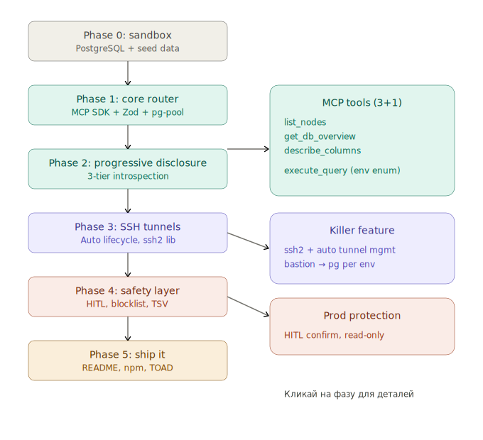

# toad-tunnel-mcp

Multi-environment PostgreSQL MCP router with SSH tunnel management.

> One MCP endpoint. All your environments. Auto-managed SSH tunnels.



## Problem

Enterprise PostgreSQL setups span multiple environments (dev, stage, prod), each with separate credentials and often behind SSH bastions. Current MCP database tools require a separate server instance per database, bloating the context window with 60k-150k tokens of metadata and dropping tool selection accuracy to ~49%.

## Solution

A unified MCP server that:

- Exposes **3+1 tools** instead of 72+ (99% token reduction)
- Routes queries via `env` enum validated by Zod — protocol-enforced safety
- Auto-manages **SSH tunnels** per environment (lazy connect → keep-alive → idle disconnect)
- Implements **progressive disclosure** — model only loads schema it needs
- Enforces **HITL confirmation** for prod, keyword blocklists, row budgets

## Quick Start

```bash
npm install

# Start sandbox databases
npm run sandbox:up

# Run in dev mode
npm run dev
```

## Config

```yaml
# config/toad-tunnel.yaml
project: my-project

environments:
  dev:
    host: localhost
    port: 5432
    database: my_dev_db
    user: dev_user
    password: ${DEV_PG_PASSWORD}
    permissions: read-write
    approval: auto

  prod:
    host: prod-db.internal
    port: 5432
    database: my_prod_db
    user: prod_reader
    password: ${PROD_PG_PASSWORD}
    permissions: read-only
    approval: hitl
    tunnel:
      bastion: bastion.prod.company.com
      bastion_port: 22
      key_path: ~/.ssh/prod_key
      local_port: 5434
```

## Claude Code Integration

```json
{
  "mcpServers": {
    "toad-tunnel": {
      "command": "npx",
      "args": ["tsx", "/path/to/toad-tunnel-mcp/src/index.ts"],
      "env": {
        "TOAD_CONFIG": "/path/to/toad-tunnel.yaml",
        "DEV_PG_PASSWORD": "...",
        "PROD_PG_PASSWORD": "..."
      }
    }
  }
}
```

## Roadmap

| Phase | Description                                                   | Status     |
| ----- | ------------------------------------------------------------- | ---------- |
| 0     | Sandbox Setup — multi-env PostgreSQL playground               | ✅ Done    |
| 1     | Core MCP Router — single endpoint, multi-env routing          | ✅ Done    |
| 2     | Progressive Disclosure — token-efficient schema introspection | 🔜 Next    |
| 3     | SSH Tunnel Management — auto lifecycle per environment        | ⏳ Planned |
| 4     | Safety Layer — defense-in-depth for production                | ⏳ Planned |
| 5     | Ship It — npm publish, docs, CI                               | ⏳ Planned |

## License

MIT
